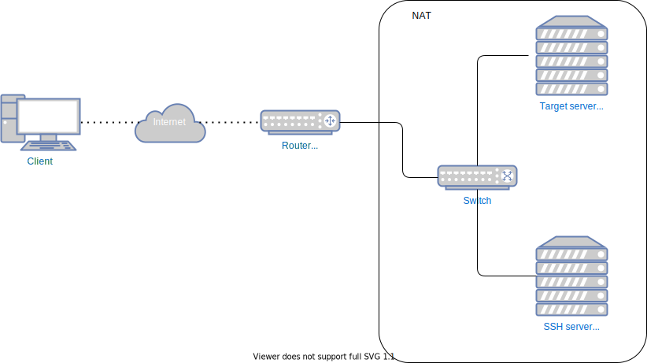

# SSH tunnels

## SSH server exposed to the Internet



Use SSH service on `SSH server` to access the service running on `Targert server`. The service will be accessible on 127.0.0.1 on port 12345.

```sh
ssh -L 12345:192.168.100.110:8080 user@1.1.1.1:10022
```

## SSH server not exposed to the Internet
