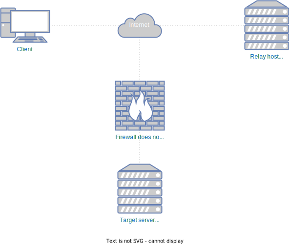

# SSH tunnels

## SSH server exposed on the Internet


Use SSH service on `SSH server` to access the service running on `Targert server`. Execute the command on the `Client`. The service will be accessible locally on the port 12345.

```sh
ssh -L 12345:192.168.100.110:8080 user@1.1.1.1:10022
```

## Reverse SSH tunnel



Following scenario allows you to connnect to a SSH service running on a server which is not publically available on the Internet. To achieve this you need a public server running SSH service which will act as an relay host.

### Actions on the target server

On the `Target server` you need to establish a SSH tunnel with the `Relay host`.

```shell
ssh -R 50022:localhost:10022 user@1.1.1.1
```

The command will connect via SSH to the `Relay host` and establish a reverse tunnel. It forwards all traffic on port `50022` on `Relay server` to port `10022` on `Target server`.

### Connecting to the target server from the Internet

Establish a SSH connection with the `Relay host`:

```shell
ssh user@1.1.1.1
```

From the `Relay host` you can open a SSH connection with the `Target server`:

```
ssh -p 50022 target-user@127.0.0.1
```

## SSH SOCKS proxy

Use the SSH service running on `some-ssh-server` as a SOCKS proxy.

```
ssh -D 12345 user@some-ssh-server
```
